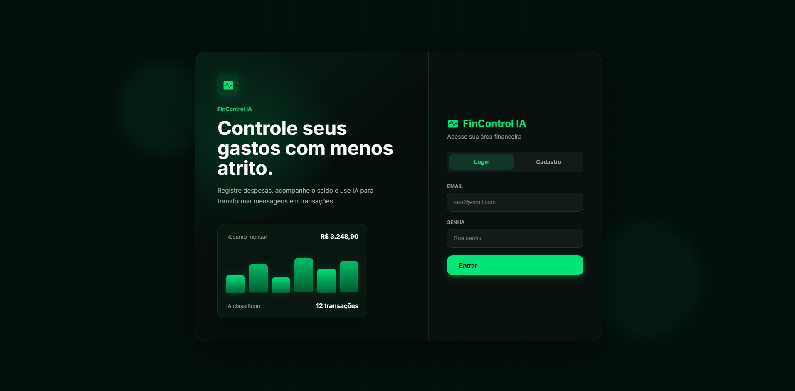
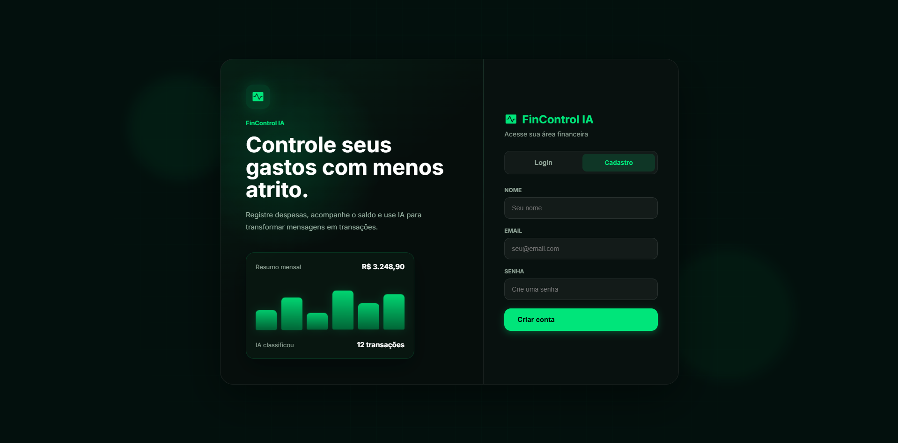
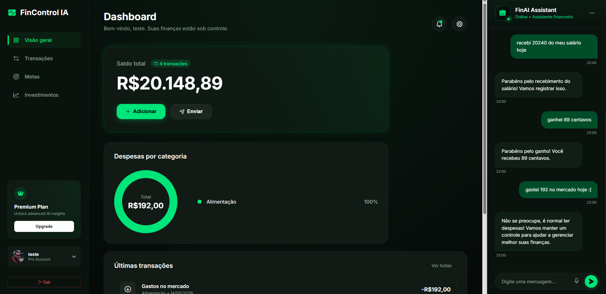
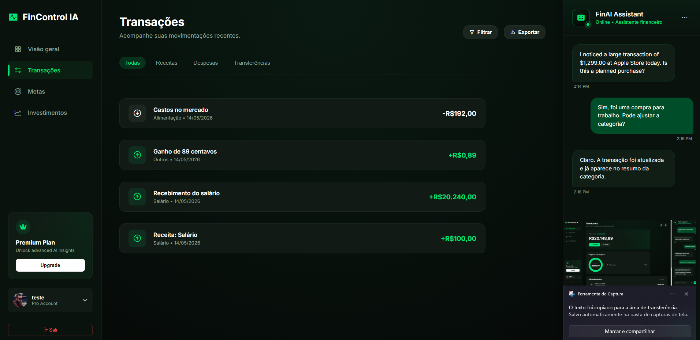
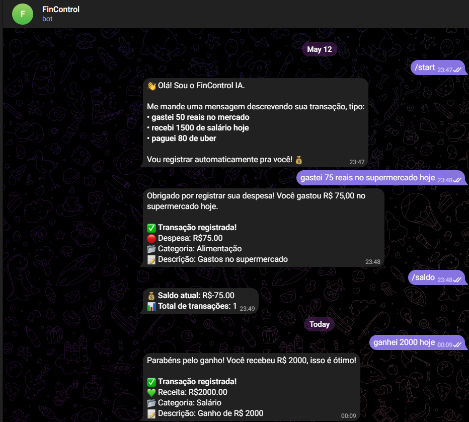

# FinControl IA

Plataforma de controle financeiro pessoal com dashboard web, autenticação JWT, registro de transações e assistente com IA para interpretar mensagens financeiras em linguagem natural.

O projeto nasceu como uma evolução de um trabalho acadêmico e foi reestruturado para funcionar como uma aplicação completa: frontend, API, banco de dados, integração com IA e bot no Telegram.

## Links

| Ambiente | Link |
| --- | --- |
| Aplicação web | [fincontrol-ia.vercel.app](https://fincontrol-ia.vercel.app/) |
| API em produção | [fincontrol-ia.onrender.com](https://fincontrol-ia.onrender.com/) |
| Documentação Swagger | [fincontrol-ia.onrender.com/docs](https://fincontrol-ia.onrender.com/docs) |
| Bot Telegram | [@IaFinControl_Bot](https://t.me/IaFinControl_Bot) |

## Demonstração

O usuário pode registrar movimentações manualmente pelo dashboard ou escrever uma mensagem comum para a IA, como:

```text
gastei 75 reais no supermercado hoje
recebi 2000 do salário
ganhei 89 centavos
```

A API interpreta a mensagem, identifica se é receita ou despesa, classifica a categoria e salva a transação no banco de dados.

## Screenshots

| Login | Cadastro |
| --- | --- |
|  |  |

| Dashboard | Transações |
| --- | --- |
|  |  |

| Bot Telegram |
| --- |
|  |

## Funcionalidades

- Cadastro e login de usuários
- Autenticação com JWT
- Rotas financeiras protegidas por token
- Registro manual de receitas e despesas
- Registro de transações com IA usando linguagem natural
- Dashboard com saldo total, gráfico por categoria e últimas movimentações
- Filtro visual de receitas e despesas
- Bot no Telegram integrado ao fluxo financeiro
- Documentação automática com Swagger
- Deploy do frontend na Vercel
- Deploy da API no Render

## Tecnologias

| Camada | Tecnologias |
| --- | --- |
| Frontend | HTML, CSS, JavaScript |
| Backend | FastAPI, SQLAlchemy, Pydantic |
| Autenticação | JWT, Passlib, Bcrypt |
| IA | Groq |
| Bot | python-telegram-bot |
| Banco de dados | SQLite |
| Deploy | Vercel, Render |

## Arquitetura

```text
Usuário
  |
  | acessa
  v
Frontend Vercel
  |
  | requisições HTTP com JWT
  v
API FastAPI no Render
  |
  | salva e consulta dados
  v
SQLite

Telegram Bot
  |
  | envia mensagens financeiras
  v
API / IA
```

## Estrutura do Projeto

```text
fincontrol-ia/
├── app/
│   ├── routers/
│   │   ├── ai.py
│   │   ├── auth.py
│   │   ├── transactions.py
│   │   └── users.py
│   ├── ai_parser.py
│   ├── auth.py
│   ├── database.py
│   ├── main.py
│   ├── models.py
│   └── schemas.py
├── docs/
│   └── screenshots/
├── legacy/
│   └── fincontrol_backend/
├── prototipo/
├── index.html
├── script.js
├── styles.css
├── bot.py
├── Procfile
├── DEPLOY.md
└── requirements.txt
```

## Como Rodar Localmente

Clone o repositório:

```powershell
git clone https://github.com/isawc/fincontrol-ia.git
cd fincontrol-ia
```

Crie e ative o ambiente virtual:

```powershell
python -m venv venv
.\venv\Scripts\activate
```

Instale as dependências:

```powershell
pip install -r requirements.txt
```

Crie um arquivo `.env` baseado no `.env.example`:

```env
DATABASE_URL=sqlite:///./fincontrol.db
SECRET_KEY=sua-chave-secreta
GROQ_API_KEY=sua-chave-groq
GROQ_MODEL=llama-3.3-70b-versatile
MAX_TOKENS=1500
TELEGRAM_BOT_TOKEN=seu-token-do-telegram
```

Inicie a API:

```powershell
uvicorn app.main:app --reload
```

Acesse a documentação:

```text
http://127.0.0.1:8000/docs
```

Para testar o frontend localmente, abra o arquivo `index.html` no navegador.

## Principais Endpoints

| Método | Rota | Descrição |
| --- | --- | --- |
| `POST` | `/auth/register` | Cria uma conta e retorna um token JWT |
| `POST` | `/auth/login` | Autentica o usuário |
| `GET` | `/users/me` | Retorna os dados do usuário autenticado |
| `GET` | `/transactions/` | Lista as transações do usuário |
| `POST` | `/transactions/` | Cria uma nova transação |
| `DELETE` | `/transactions/{id}` | Remove uma transação |
| `POST` | `/ai/parse` | Interpreta uma mensagem financeira com IA |

## Exemplo de Uso da IA

Requisição:

```json
{
  "message": "gastei 75 reais no supermercado hoje"
}
```

Resposta esperada:

```json
{
  "reply": "Despesa registrada com sucesso.",
  "action_taken": true,
  "transaction": {
    "amount": 75,
    "type": "expense",
    "category": "Alimentação",
    "description": "Gastos no supermercado"
  }
}
```

## Desafios e Aprendizados

Uma das primeiras decisões técnicas foi trocar o envio de `user_id` pelo frontend por autenticação com JWT. No início, algumas rotas dependiam de um ID fixo, o que funcionava para teste, mas não representava um fluxo real de login. A solução foi proteger as rotas financeiras e fazer o backend identificar o usuário pelo token enviado no header `Authorization`.

Outro desafio foi conectar o dashboard a dados reais. A interface começou com valores estáticos, mas depois o saldo, o gráfico por categoria e a lista de últimas movimentações passaram a ser calculados a partir das transações retornadas pela API.

Também houve um problema de compatibilidade com `bcrypt` durante o cadastro de usuários. A correção foi fixar uma versão estável no `requirements.txt`, garantindo que o hash de senha funcionasse no ambiente local e em produção.

Na parte de deploy, o projeto foi separado em dois ambientes: frontend na Vercel e backend no Render. Essa divisão deixou o projeto mais próximo de uma arquitetura real, com o frontend consumindo uma API publicada.

## Melhorias Futuras

- Adicionar edição de transações
- Melhorar os filtros por período e categoria
- Criar painel específico para metas financeiras
- Persistir o histórico do chat com IA
- Evoluir o bot do Telegram para consultar saldo e últimas movimentações
- Trocar SQLite por PostgreSQL em produção
- Ajustar CORS para aceitar apenas os domínios do projeto

## Observação

Este projeto não oferece consultoria financeira profissional. As respostas da IA são usadas apenas para auxiliar na organização financeira pessoal.
